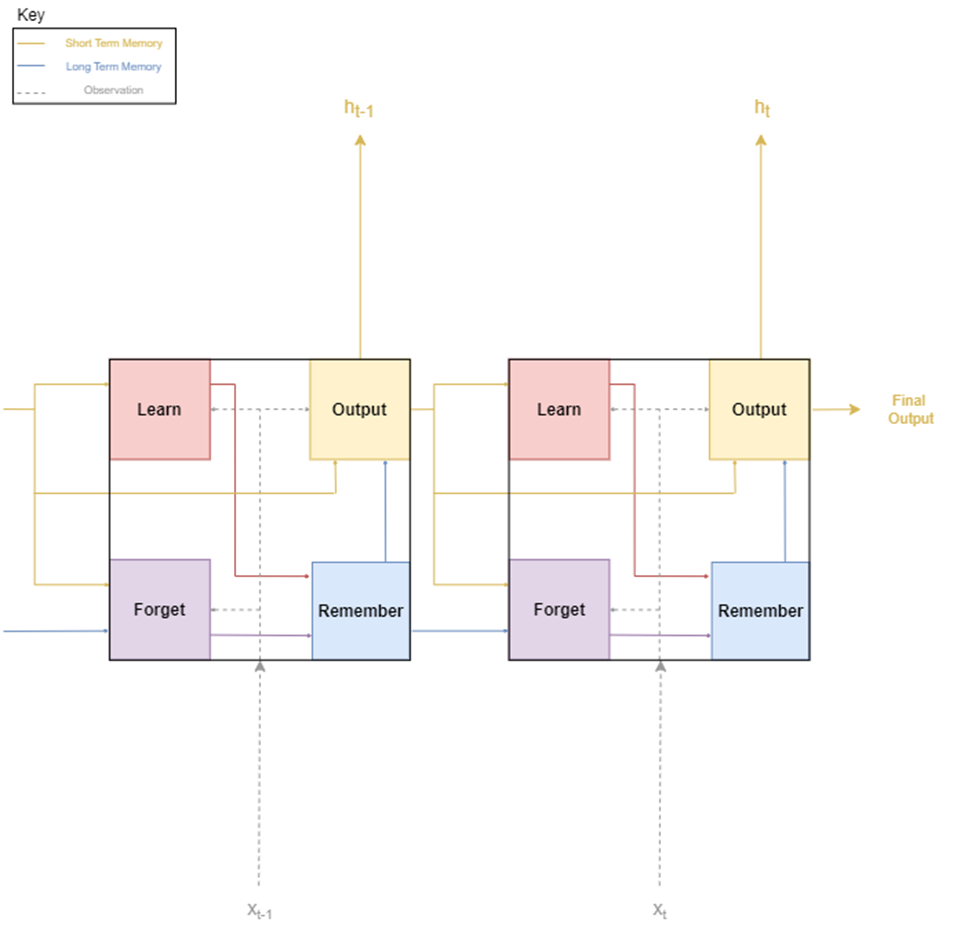
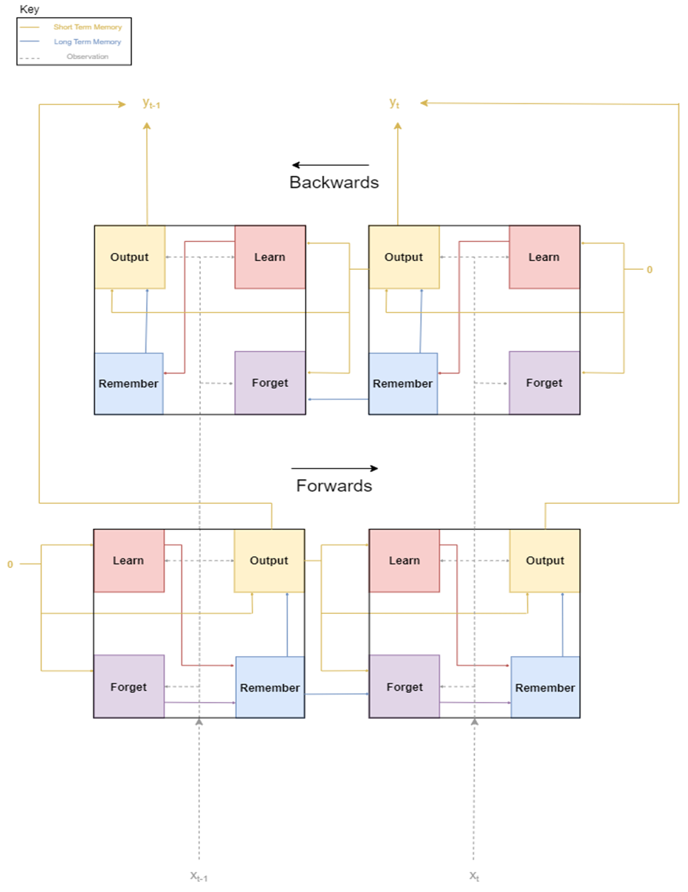
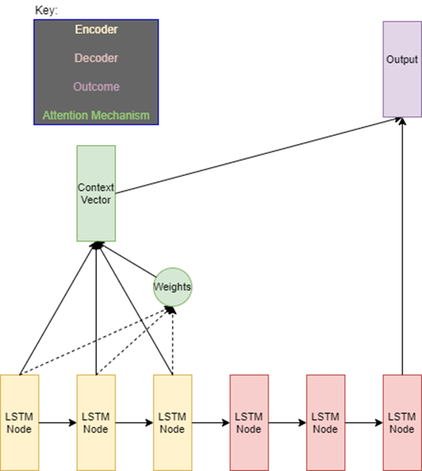
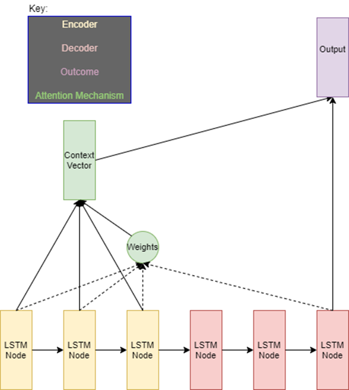
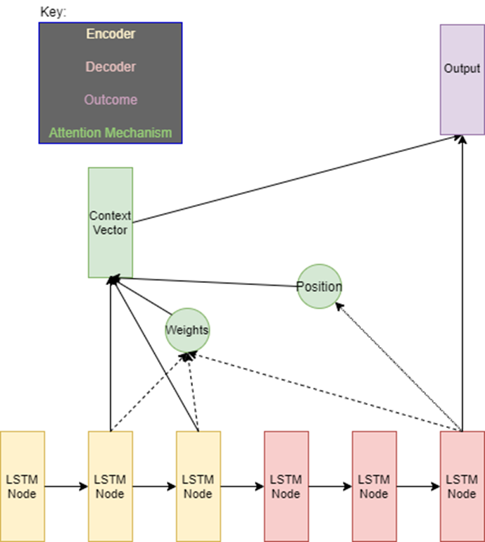
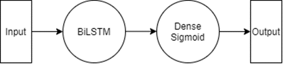
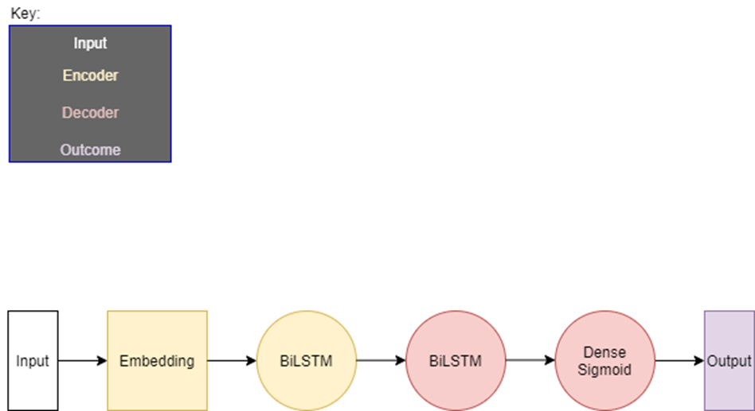
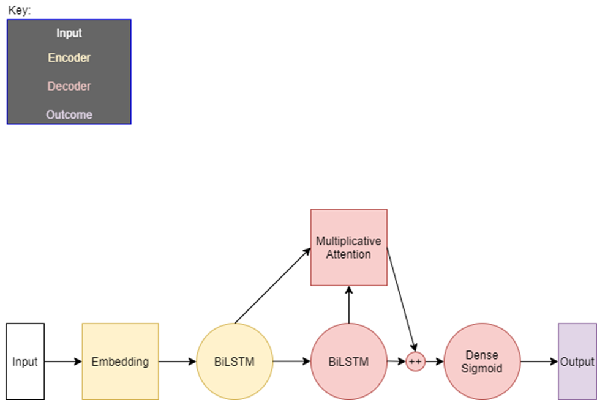

# 
Paying Attention to Product Reviews:
 
Sentiment Analysis with Additive, Multiplicative, and Local Attention Mechanisms 

***

## Purpose
___
This work aims to add to the existing work in NLP regarding attention mechanisms in sentiment analysis. Specifically this work uses data gathered from the Athena console on amazon tool product reviews to build and compare 5 different models, but its focus is on the three attention based networks. The Model Builder folder contains the code that was used to generate the output, the results are given at the end of this README. 

All the code and this README were created to support the thesis paper that will be included in this repository. The data used for this work is not included in this repo for file size reasons, but the sources used to get is the final citation in the references. All other sources used to make this work are also included in the references. The rest of this file goes through the framework/math behind the models and custom-built layers. The results of the project are displayed at the end just before the references.   

## Layers
***
### LSTM

#### Visual of the gates of an LSTM

I broke this down into four gates, the math will go through the operations in each gate. To get a better understanding of the reasoning behind these gates I suggest reading the Traditional Sentiment Strategies section of the paper in this repository.

#### Math behind an LSTM Layer

##### Givens:
Wn : learning weight  
bn : learning bias  
Wi : ignoring weights  
bi : ignoring bias  
Wf : forgetting weights  
bf : forgetting bias  
Wo : forgetting weights  
bo : forgetting bias  
xt : current input  
h(t-1) : short term memory from previous timestamp  
l(t-1) : long term memory from previous timestamp

##### Equations:  
Learn Gate:  
Nt = σ(Wn[h(t-1),xt ]+bn)  
it= tanh(Wi[h(t-1),xt ]+bi)  
Mt = Nt×it  

Forget Gate:  
ft = σ(Wf [h(t-1),xt]+bf)  
Zt = l(t-1)×ft  

Remember Gate:  
Rt = Mt + Zt

Output Gate:  
Ot = σ(Wo [h(t-1),xt]+bo)  
ht = Ot×tanh(Rt)

### BiLSTM

#### Visual of the gates and flow of a BiLSTM

This runs the above LSTM layer two times starting from either end of the text. A further explanation of this is given in the Traditional Sentiment Strategies section of the paper in this repository. 

### Additive Attention

####Visual of Additive Attention

#### Math behind Additive Attention

##### Givens:

ht ∶ Output from the last encoder node  
hs ∶ The output from all BiLSTM encoder nodes  
W1 ∶ A fully connected layer  
W2 ∶ A fully connected layer
V∶ A fully connected layer

##### Equations:
A = W1 (ht)+W2(hs)  
S = score(ht,hs) = V(tanh(A))  
αts = softmax(S) =  exp(score(ht,hs))&frasl;∑(s'=1)exp(score(ht,hs'))  
Ct= ∑αtshs

### Multiplicative Attention

#### Visual of Multiplicative Attention

#### Math behind Multiplicative Attention

##### Givens: 

ht ∶ Output from the last decoder node  
hs ∶ The output from all BiLSTM encoder nodes  
W ∶ A fully connected layer

##### Equations:

S = score(ht,hs) = htWhs  
αts = softmax(S) =  exp(score(ht,hs))&frasl;∑(s'=1)exp(score(ht,hs'))  
Ct= ∑αtshs

### Local Attention

#### Visual of Local Attention

#### Math behind Local Attention

##### Givens:

ht ∶ Output from the last decoder node  
hs ∶ The output from all BiLSTM encoder nodes  
W1 ∶ A fully connected layer  
W2 ∶ A fully connected layer  
V ∶ A fully connected layer  
D : The width of the window (hyperparameter)

##### Equations:

N = W1(ht)  
M = V(tanh(N))  
pt = S×sigmoid(M)  
αt = softmax(htW2hs)  
αt(s) = αt×exp(-(i-pt)2&frasl;2σ2)    
Ct= ∑αtshs

## Models

### Basic BiLSTM:

### BiLSTM Encoder-Decoder:

### Additive Attention Model:

### Multiplicative Attention Model:

The Local Attention model has the same layout as the Multiplicative the attention mechanism is the only difference. Therefore, I did a separate graphic to denote that one minor change. 

## Results
|Model | Accuracy | Precision | Recall |
|------|---------|-----------|--------|
|Basic BiLSTM	|.569|	.594|	.440|
|BiLSTM Encoder-Decoder	|.826|	.804|	.794|
|Additive Attention|	.842|	.856|	.824|
|Multiplicative Attention|	.840|	.830|	.855|
|Local Attention|	.853|	.849|	.859|

## References
1.	Wang, Yequan. "Attention-based LSTM for Aspect-level Sentiment Classification." Proceedings of the 2016 Conference on Empirical Methods in Natural Language Processing, November 2016, 606-15. Accessed February 4, 2021.
2.	Luong, Minh-Thang, Hieu Pham, and Christopher D. Manning. "Effective approaches to attention-based neural machine translation." arXiv preprint arXiv:1508.04025 (2015).
3.	Galassi, Andrea, Marco Lippi, and Paolo Torroni. "Attention in natural language processing." IEEE Transactions on Neural Networks and Learning Systems (2020).
4.	Liu, Jiangming, and Yue Zhang. "Attention modeling for targeted sentiment." In Proceedings of the 15th Conference of the European Chapter of the Association for Computational Linguistics: Volume 2, Short Papers, pp. 572-577. 2017.
5.	Wang, Jin, Liang-Chih Yu, K. Robert Lai, and Xuejie Zhang. "Dimensional sentiment analysis using a regional CNN-LSTM model." In Proceedings of the 54th annual meeting of the association for computational linguistics (volume 2: Short papers), pp. 225-230. 2016.
6.	Vaswani, Ashish, Noam Shazeer, Niki Parmar, Jakob Uszkoreit, Llion Jones, Aidan N. Gomez, Lukasz Kaiser, and Illia Polosukhin. "Attention is all you need." arXiv preprint arXiv:1706.03762 (2017).
7.	Cheng, Jianpeng, Li Dong, and Mirella Lapata. "Long short-term memory-networks for machine reading." arXiv preprint arXiv:1601.06733 (2016).
8.	Mousa, Amr, and Björn Schuller. "Contextual bidirectional long short-term memory recurrent neural network language models: A generative approach to sentiment analysis." In Proceedings of the 15th Conference of the European Chapter of the Association for Computational Linguistics: Volume 1, Long Papers, pp. 1023-1032. 2017.
9.	Vijayarani, S., Ms J. Ilamathi, and Ms Nithya. "Preprocessing techniques for text mining-an overview." International Journal of Computer Science & Communication Networks 5, no. 1 (2015): 7-16.
10.	Bahdanau, Dzmitry, Kyunghyun Cho, and Yoshua Bengio. "Neural machine translation by jointly learning to align and translate." arXiv preprint arXiv:1409.0473 (2014).
11.	Hochreiter, Sepp, and Jürgen Schmidhuber. "Long short-term memory." Neural computation 9, no. 8 (1997): 1735-1780.
12.	Cho, Kyunghyun, Bart Van Merriënboer, Caglar Gulcehre, Dzmitry Bahdanau, Fethi Bougares, Holger Schwenk, and Yoshua Bengio. "Learning phrase representations using RNN encoder-decoder for statistical machine translation." arXiv preprint arXiv:1406.1078 (2014).
13.	Malik, Usman. "Removing Stop Words from Strings in Python." Stack Abuse. Accessed April 02, 2021. https://stackabuse.com/removing-stop-words-from-strings-in-python/#:~:text=NLTK supports stop word removal,stop words provided by NLTK.
14.	Amazon Customer Reviews Dataset. Accessed April 02, 2021. https://s3.amazonaws.com/amazon-reviews-pds/readme.html.

